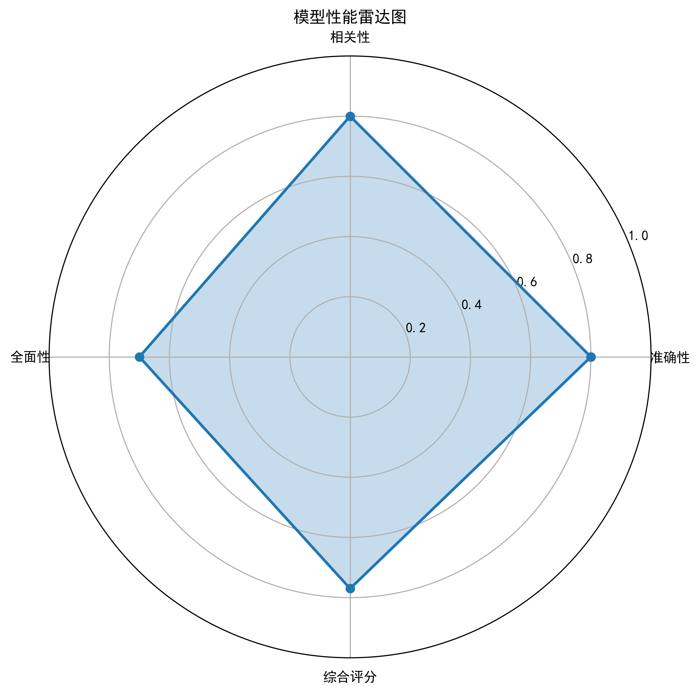
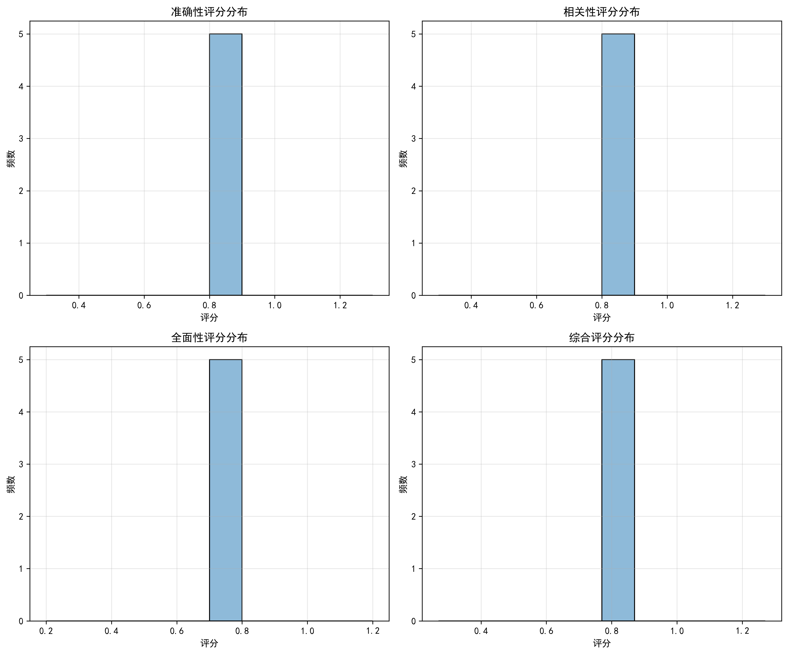

# AI Stocks Agent

一个基于LangChain、LangGraph和RAG技术的股票智能体项目，支持本地Ollama和VLLM两种模型推理方式。

## 项目简介

AI Stocks Agent是一个专注于股票市场分析的智能体系统，能够提供以下功能：
- 股票基本面分析
- 技术指标解读
- 历史数据分析
- 市场事件关联
- 投资策略建议

项目支持两种本地模型推理方式：
- **Ollama**：轻量级本地LLM管理工具
- **VLLM**：高性能LLM推理服务

## 项目结构

```
ai-stocks-agent/
├── requirements.txt      # 项目依赖
├── .env                 # 环境变量配置
├── data/                # 数据存储目录
├── tools/               # 工具函数
├── stockschain/         # 股票链相关代码
│   ├── ollama/          # Ollama模型推理
│   ├── vllm/            # VLLM模型推理
│   ├── model_selector.py # 模型选择器
│   └── demo_usage.py    # 示例用法
├── stocksgraph/         # 股票图工作流
├── rag/                 # RAG相关代码
└── stocksmith/          # LangSmith分析评估工具
    ├── __init__.py      # 包初始化
    ├── evaluator.py     # 评估器实现
    ├── visualizer.py    # 可视化工具
    └── example_usage.py # 评估功能示例
```

## 安装指南

### 1. 克隆项目

```bash
git clone <项目地址>
cd ai-stocks-agent
```

### 2. 安装依赖

```bash
pip install -r requirements.txt
```

### 3. 配置环境变量

复制并编辑.env文件，根据您的环境配置相应的参数：

```bash
# 复制示例环境变量文件
cp .env.example .env
# 编辑.env文件
```

主要配置项：
- `OPENAI_API_KEY`：OpenAI API密钥（可选，用于对比测试）
- `LANGCHAIN_TRACING_V2`：是否启用LangChain跟踪
- `LANGCHAIN_API_KEY`：LangSmith API密钥
- `OLLAMA_BASE_URL`：Ollama服务地址，默认http://localhost:11434
- `OLLAMA_MODEL`：Ollama使用的模型，默认llama3:8b
- `VLLM_API_URL`：VLLM服务地址，默认http://localhost:8000/generate
- `VLLM_MODEL`：VLLM使用的模型，默认meta-llama/Llama-3-8b-instruct

### 4. 启动本地模型服务

#### Ollama

1. 安装Ollama：https://ollama.ai/download
2. 启动Ollama服务（通常安装后自动启动）
3. 拉取所需模型：
   ```bash
   ollama pull llama3.2:8b
   ```

#### VLLM

使用以下命令启动VLLM服务：

```bash
python -m vllm.entrypoints.api_server --model meta-llama/Llama-3-8b-instruct --port 8000
```

## 使用示例

### 基本使用

```python
from stockschain.model_selector import ModelSelector

# 初始化模型选择器
model_selector = ModelSelector(default_model_type='ollama')

# 使用Ollama模型
response_ollama = model_selector.invoke(
    "什么是股票基本面分析？",
    system_prompt="你是一位专业的金融分析师。"
)
print(response_ollama)

# 使用VLLM模型
response_vllm = model_selector.invoke(
    "什么是股票基本面分析？",
    model_type='vllm',
    system_prompt="你是一位专业的金融分析师。"
)
print(response_vllm)
```

### 运行示例脚本

```bash
cd stockschain
python demo_usage.py
```

### LangSmith分析评估使用示例

以下是如何使用stocksmith模块进行股票分析评估的示例：

```python
from stocksmith.evaluator import StocksEvaluator
from stocksmith.visualizer import StocksVisualizer
from stockschain.model_selector import ModelSelector

# 初始化模型选择器
model_selector = ModelSelector(default_model_type='ollama')

# 准备测试用例
test_cases = [
    {
        "query": "分析苹果公司(APPL)的基本面情况",
        "reference_answer": "苹果公司是全球领先的科技公司，主要产品包括iPhone、iPad、Mac等。最新季度财报显示营收增长5%，净利润增长8%，毛利率维持在45%左右。公司现金流状况良好，研发投入持续增加，新产品管线丰富。"
    },
    # 更多测试用例...
]

# 运行分析并收集结果
results = []
for case in test_cases:
    response = model_selector.invoke(
        case["query"],
        system_prompt="你是一位专业的金融分析师。"
    )
    results.append({
        "query": case["query"],
        "reference_answer": case["reference_answer"],
        "prediction": response
    })

# 初始化评估器并进行评估
evaluator = StocksEvaluator()
evaluation_results = evaluator.evaluate(results)

# 保存评估结果
evaluator.save_evaluation_results(evaluation_results, "visualizations/evaluation_results.json")

# 可视化评估结果
visualizer = StocksVisualizer()
visualizer.generate_visualizations(
    evaluation_results,
    radar_chart_path="visualizations/radar_chart.png",
    score_distribution_path="visualizations/score_distribution.png",
    comparison_path="visualizations/interactive_comparison.html"
)

print("评估完成！可视化结果已保存到visualizations目录")
```

#### 运行完整分析

可以使用以下命令运行完整的分析、评估和可视化流程：

```bash
python stocksmith/example_usage.py --run-full-analysis
```

#### 仅运行评估

如果只需要运行评估而不进行完整分析，可以使用：

```bash
python stocksmith/example_usage.py --run-evaluation
```






## 功能模块

### 1. 模型推理模块

- **OllamaLLM**：封装了Ollama本地模型的调用接口
- **VLLM**：封装了VLLM高性能推理服务的调用接口
- **ModelSelector**：提供统一的接口，可在不同模型间切换

### 2. 数据处理

项目支持获取和分析以下股票数据：
- 历史价格数据
- 公司财务报表
- 市场新闻和事件
- 技术指标

### 3. RAG检索增强

通过RAG技术，智能体可以检索相关的股票知识和历史数据，为用户提供更准确的分析和建议。

### 4. LangSmith分析评估模块

stocksmith模块提供了强大的股票分析评估功能，可以评估模型生成的股票分析结果的质量。主要功能包括：

#### 4.1 评估指标

- **准确性评估(Accuracy)**：评估分析结果与参考答案的匹配程度
- **相关性评估(Relevance)**：评估生成内容与查询问题的相关程度
- **全面性评估(Comprehensiveness)**：评估分析内容是否全面覆盖了相关方面
- **整体评分(Overall Score)**：综合上述指标得出的总体评分

#### 4.2 评估方法

- **StocksEvaluator**：核心评估器类，实现了各种评估指标的计算
- **LocalRun**：本地运行记录类，用于在没有LangSmith配置时模拟运行记录
- **LocalEvaluationResult**：本地评估结果类，模拟LangSmith评估结果

#### 4.3 可视化功能

- **StocksVisualizer**：可视化工具类，可生成评估结果的图表和交互式比较
- 支持雷达图、得分分布图和交互式比较表格等多种可视化形式

#### 4.4 本地和云端评估

- 支持在配置了LangSmith的情况下使用云端评估功能
- 在没有LangSmith配置时自动切换到本地评估模式
- 自动序列化评估结果并保存为JSON格式


## 注意事项

1. 确保Ollama和VLLM服务已正确启动
2. 首次使用时，模型可能需要一些时间加载
3. 对于大型模型，建议有足够的硬件资源（尤其是VLLM）
4. 项目依赖的一些API可能需要相应的访问权限

## 扩展建议

1. 添加更多的股票分析工具和指标
2. 实现更复杂的LangGraph工作流
3. 集成更多的数据源
4. 开发Web界面或API服务

## License

[MIT](LICENSE)


## 项目依赖列表

以下是AI Stocks Agent项目中使用的所有依赖包及其版本:

> 1. langgraph-sdk>=0.2.0 - 用于构建LangGraph工作流
> 2. openai>=1.0.0 - OpenAI API客户端
> 3. pandas>=2.0.0 - 数据分析库
> 4. numpy>=1.24.0 - 科学计算库
> 5. matplotlib>=3.7.0 - 数据可视化库
> 6. scikit-learn>=1.3.0 - 机器学习库
> 7. sentence-transformers>=2.2.0 - 句子嵌入模型
> 8. faiss-cpu>=1.7.4 - 高效相似度搜索和聚类库
> 9. finviz==1.4.6 - 金融数据可视化工具
> 10. yfinance>=0.2.31 - Yahoo Finance API客户端
> 11. pydantic>=2.0.0 - 数据验证库
> 12. python-dotenv>=1.0.0 - 环境变量管理
> 13. langsmith>=0.0.70 - LangChain追踪和监控工具
> 14. plotly>=5.15.0 - 交互式数据可视化库
> 15. seaborn>=0.12.0 - 统计数据可视化库
> 16. ollama>=0.1.0 - Ollama本地LLM客户端
> 17. vllm>=0.3.3 - 高性能LLM推理库